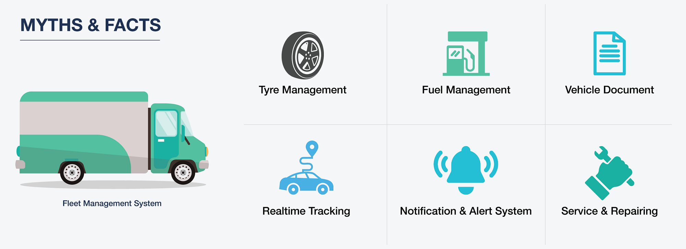
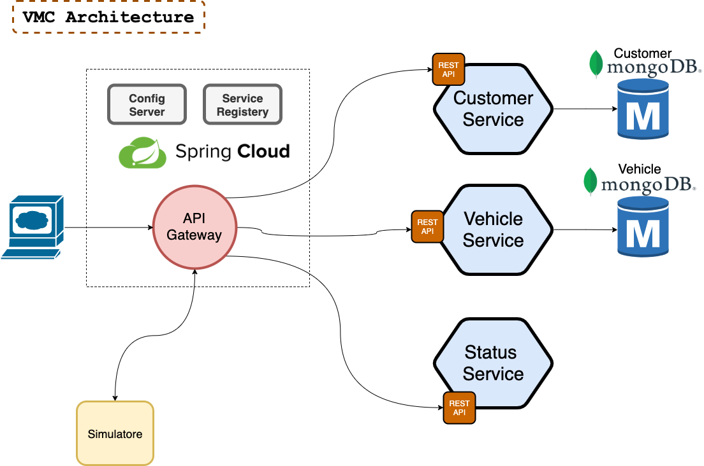
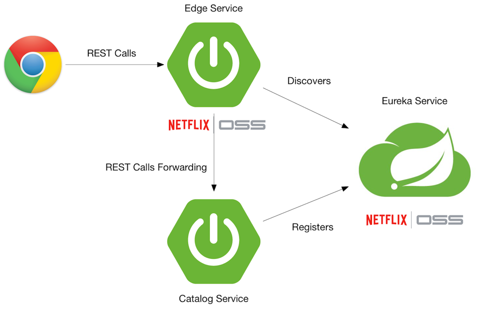
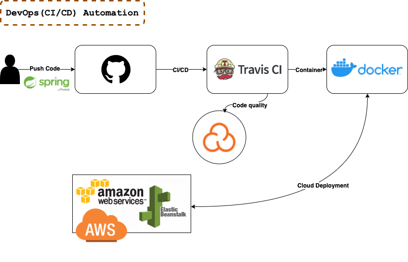

# **Vehicle Management Challenge**

**Vehicle management Challenge** refers to an application that helps business enterprises coordinate and manage work vehicles in a central information system for the smooth functioning of the entire organization.

The aim of this challenge is simply to provide a system that can manage a group of commercial vehicles over a large geographical area.
It might include handling of vehicle maintenance, financing, tracking, replacement, navigation, and routing.

## **System Overview**

A company has the following:
1. A number of connected vehicles that belongs to a number of customers.
2. They have a need to be able to view the status of the connection among these vehicles on a monitoring display.
3. The vehicles send the status of the connection one time per minute.
4. The status can be compared with a ping (network trace); no request from the vehicle means no connection.

## **The Challenge**

Create a data store that keeps these vehicles with their status and the customers who own them, as well as a GUI (preferably web-based) that displays the status.

> Note: How the GUI is designed is up to you, as well as how you chose to implement the features and use suitable technologies.

Obviously, for this task, there are no real vehicles available that can respond to your "ping" request.
This can either be solved by using static values or ​​by creating a separate machinery that returns random fake status.

## **System Requirements**
1. Web GUI (Single Page Application Framework/Platform).
 - An overview of all vehicles should be visible on one page (full-screen display), together with their status.
 - It should be able to filter, to only show vehicles for a specific customer.
 - It should be able to filter, to only show vehicles that have a specific status.
2. Random simulation to vehicles status sending.
3. If database design will consume a lot of time, use data in-memory representation.
4. Unit Testing.
5. .NET Core, Java or any native language.
6. Complete analysis for the problem.
 - Full architectural sketch to solution.
 - Analysis behind the solution design, technologies,....
 - How the solution will make use of cloud.
 - Deployment steps.

## **Optional Requirements**
1. Write an integration tests.
2. Write an automation test.
3. Use CI(Travis, Circle, TeamCity...) to verify your code (Static analysis,..) and tests.
4. Dockerize the whole solution.
5. Microservices architecture for driver, vehicle and FaaS APIs.
 - Use any Microservices Chassis Framework.
6. Explain if it is possible to be in Serverless architecture and how?

## **Data**

Below you have all customers from the system; their addresses and the vehicles they own.

### Customer (1):

**Kalles Grustransporter AB**

**Cementvägen 8, 111 11 Södertälje**

| VIN (VehicleId)   | Reg. nr. |
| ----------------- | -------- |
| YS2R4X20005399401 | ABC123   |
| VLUR4X20009093588 | DEF456   |
| VLUR4X20009048066 | GHI789   |

### Customer (2):

**Johans Bulk AB**

**Balkvägen 12, 222 22 Stockholm**

| VIN (VehicleId)   | Reg. nr. |
| ----------------- | -------- |
| YS2R4X20005388011 | JKL012   |
| YS2R4X20005387949 | MNO345   |

### Customer (3):

**Haralds Värdetransporter AB**

**Budgetvägen 1, 333 33 Uppsala**

| VIN (VehicleId)   | Reg. nr. |
| ----------------- | -------- |
| VLUR4X20009048066 | PQR678   |
| YS2R4X20005387055 | STU901   |

# **Solution Architecture**

We aim to build the VMC using **Microservice Architecture** which brings a great flexibility and added resilience to our code.

So as depected in the picture, we have three main services (vehicle, customer and Status) which handle the business logic of the application.
We have other services which is part of the microservice architecture pattern:
- Service Registry
- Config Server
- API Gateway

> Note: it's also important to realize what a microservice is not:
- A microservice is not a service that has a small number of lines of code or does "micro" tasks. This misconception comes from the name "microservice". The goal of the microservice architecture is not to have as many small services as possible. Services could be complex and substantial as long as they meet the above three principles.
- A microservice is not a service that is built with new technology all the time. Even though the microservice architecture allows teams to test new technology more easily, it is not the primary goal of microservice architecture. It is totally fine to build new services with the exact same technology stack, as long as the team benefits from decoupled services.
- A microservice is not a service that has to be built from scratch. When you have a well-architected monolithic app already, avoid getting into the habit to build every new service from scratch. There might be opportunities to extract the logic from the monolithic service directly. Again, the above three principles should still hold.

# **Technology**

We used **Spring Cloud** project which builds on top of Spring Boot, it provides a set of features to quickly build microservices. It’s very smart to know how to get them working together, can quickly setup services, with minimal configurations.

It contains things like service registration and discovery, circuit breakers, proxies, logging and log tracking, monitoring, authentication, etc.

# **DevOps (CI/CD)**

Testing is an important aspect of creating software. To ensure that unit tests are run against every build of a project, many engineering organizations have adopted the practice of continuous integration (CI), which involves using tools, such as Jenkins or Travis CI, to ensure that all new code is automatically and consistently tested for errors. 

Continuous delivery (CD) goes one step further by ensuring you can deploy every build into a production-like environment and then pass integration tests in that environment.

# **API Documentation**

- **Customer API:** [http://localhost:8051/swagger-ui.html](http://localhost:8051/swagger-ui.html 'http://localhost:8051/swagger-ui.html')
  
  
- **Vehicle API:** [http://localhost:8050/swagger-ui.html](http://localhost:8050/swagger-ui.html 'http://localhost:8050/swagger-ui.html')
  

- **Status API:** [http://localhost:8052/swagger-ui.html](http://localhost:8052/swagger-ui.html 'http://localhost:8052/swagger-ui.html')
  

# **Code Quality Analysis**

We have used **Travis CI** with **SonarCloud** to produce quality result of the whole application as depicted below in the provided badges.

